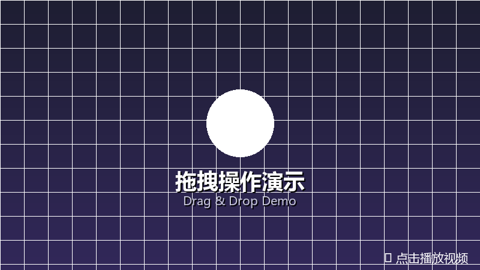
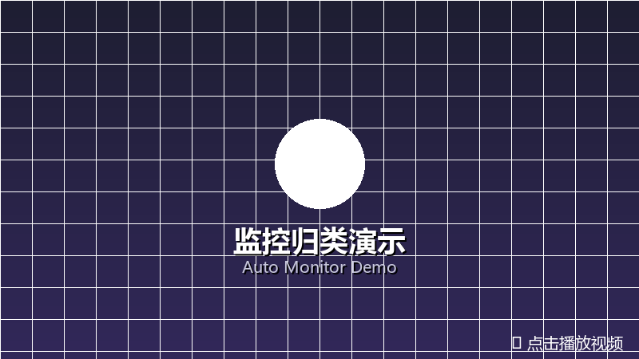

# FileNest 📃 → 🪹

> 让文件自己回家
>
> 把文件拖进来
>
> 或者让 FileNest 在后台帮你盯着
>
> 剩下的交给 FileNest
>
> 让每个文件都找到自己的巢

---

```
　　项目周报.docx　→　工作/周报/
　　东京旅行照片.jpg　→　照片/旅行/
　　设计稿_v2.fig　→　项目A/UI设计/
```

---

FileNest 会根据文件名和你的目录结构，

自动推断文件应该存放的位置。

**无需搜索。**

**无需手动整理。**

**无需记住文件应该放在哪里。**

---

除了拖拽整理，

FileNest 还可以持续监控 Downloads 或任意文件夹。

当新文件出现时，

自动推荐目标目录，

由你选择「归类」或「忽略」。

---

✅ 智能目录匹配

✅ 自动监控 Downloads 或任意文件夹

✅ 新文件实时归类建议

✅ 一键撤销

✅ 完全本地运行

[📥 Download](https://github.com/PoH888/FileNest/releases)

---

## 演示

[](https://cdn.jsdelivr.net/gh/PoH888/FileNest@main/assets/%E4%B8%AD%E6%96%87-%E6%93%8D%E4%BD%9C.mp4)

*拖拽文件自动归类到匹配目录*

[](https://cdn.jsdelivr.net/gh/PoH888/FileNest@main/assets/%E4%B8%AD%E6%96%87-%E7%9B%91%E6%8E%A7.mp4)

*后台监控新文件出现，实时推荐目标目录*

## 环境要求

- Python 3.11+（V2 后端推荐 Python 3.13）
- 桌面应用需要 Windows
- 如果要用容器运行 V2 API，需要 Docker Desktop 和 Docker Compose

## 安装

在 PowerShell 中进入存放仓库的目录，执行：

```powershell
git clone https://github.com/PoH888/FileNest.git
Set-Location .\FileNest

py -3.13 -m venv .venv
& .\.venv\Scripts\python.exe -m pip install --upgrade pip
& .\.venv\Scripts\python.exe -m pip install -r .\requirements.txt
```

CI 等价的测试命令还需要单独安装 `pytest` 和 `httpx`：

```powershell
& .\.venv\Scripts\python.exe -m pip install pytest httpx
```

## 运行

### 桌面应用

```powershell
& .\.venv\Scripts\python.exe .\main.py
```

### 本地运行 V2 API

以下命令均从仓库根目录执行。本地默认数据库为
`backend/filenest.db`。

```powershell
& .\.venv\Scripts\python.exe -m alembic -c .\backend\alembic.ini upgrade head
& .\.venv\Scripts\python.exe -m uvicorn backend.app.main:app --host 127.0.0.1 --port 8000
```

在另一个 PowerShell 窗口检查 API，并在浏览器打开
<http://127.0.0.1:8000/docs> 查看交互式文档：

```powershell
Invoke-RestMethod -Uri http://127.0.0.1:8000/api/v1/health
```

### 使用 Docker Compose 运行 V2 API

Compose 文件只包含 API 和 SQLite 数据卷。从仓库根目录启动：

```powershell
docker compose up --build --detach
Invoke-RestMethod -Uri http://127.0.0.1:8000/api/v1/health
docker compose down
```

如果需要模型配置，将 `.env.example` 复制为 `.env`，编辑本地值后再执行
`docker compose up --build --detach`。Compose 会读取 `.env` 做变量替换；
直接本地运行 Uvicorn 时，需要在当前 PowerShell 会话中设置环境变量，程序
不会自动加载 `.env`。

## 依赖

| 依赖 | 用途 |
|------|------|
| [thefuzz](https://github.com/seatgeek/thefuzz) / [rapidfuzz](https://github.com/rapidfuzz/RapidFuzz) | 文件名模糊匹配 |
| [watchdog](https://github.com/gorakhargosh/watchdog) | 文件系统监控 |
| [pystray](https://github.com/moses-palmer/pystray) / [Pillow](https://python-pillow.org) | 系统托盘和图标支持 |
| [tkinterdnd2](https://github.com/pmgagne/tkinterdnd2) | 桌面拖放支持 |
| [FastAPI](https://fastapi.tiangolo.com) / [Uvicorn](https://www.uvicorn.org) | V2 HTTP API 和 ASGI 服务 |
| [SQLAlchemy](https://www.sqlalchemy.org) / [Alembic](https://alembic.sqlalchemy.org) | SQLite 持久化和迁移 |
| [Pydantic](https://docs.pydantic.dev) / `pydantic-settings` | 数据契约和环境配置 |
| [OpenAI Python SDK](https://github.com/openai/openai-python) | OpenAI 兼容模型客户端 |
| [LangGraph](https://github.com/langchain-ai/langgraph) / `langgraph-checkpoint-sqlite` | 工作流执行和检查点 |
| `pypdf` / `python-docx` | PDF 和 DOCX 文本提取 |
| `pytest` / `httpx` | 本地和 CI 测试；不随运行时依赖安装，需单独安装 |

> tkinter 属于 Python 标准库，无需额外安装。

## 项目结构

```
FileNest/
├── main.py                    # 旧版桌面程序入口
├── backend/
│   ├── app/                   # V2 FastAPI 应用和服务
│   ├── alembic/               # 数据库迁移
│   └── alembic.ini
├── core/                      # 共享的桌面和文件逻辑
├── gui/                       # 桌面界面
├── tests/                     # 单元、集成、安全和评测测试
├── assets/                    # 图标、图片和演示媒体
├── .github/workflows/ci.yml   # 精简 CI 测试分组
├── Dockerfile                 # V2 API 镜像
├── compose.yaml               # API 和 SQLite 数据卷
├── .env.example               # 本地/Compose 环境变量模板
└── requirements.txt           # 运行时依赖
```

## 打包

以下命令打包现有的 Windows 桌面入口（`main.py`）。V2 API 使用 Uvicorn
或 Docker Compose 运行，不会打入桌面 exe。请在仓库根目录的 PowerShell
中执行：

```powershell
& .\.venv\Scripts\python.exe -m pip install pyinstaller
Remove-Item -Recurse -Force .\dist, .\build -ErrorAction SilentlyContinue
& .\.venv\Scripts\pyinstaller.exe --noconsole --onefile --name FileNest --add-data "assets;assets" --icon "assets\FileNest_big.ico" .\main.py
New-Item -ItemType Directory -Force .\dist\FileNest | Out-Null
Move-Item -Force .\dist\FileNest.exe .\dist\FileNest\
& .\.venv\Scripts\python.exe -c "import zipfile; zipfile.ZipFile('FileNest.zip','w',zipfile.ZIP_DEFLATED).write('dist/FileNest/FileNest.exe','FileNest.exe')"
```

分发结构：

```
FileNest.zip
  └── 解压 → FileNest/
                └── FileNest.exe    ← 首次运行后同级自动生成 settings.json
```

> **注意**：`--onefile` 模式下 `settings.json` 首次运行时会自动生成在 exe 所在目录（即 `FileNest/` 下），随文件夹整体移动即可带走配置。

## 配置

首次运行自动生成 `settings.json`，可通过设置窗口修改：

| 配置项 | 说明 | 默认值 |
|--------|------|--------|
| 分类目录 | 文件归类的根目录列表 | `[]` |
| 扫描深度 | 子文件夹扫描层级 | 5 |
| 自动阈值 | 高于此分数自动移动 | 85 |
| 父文件夹加权 | 父目录名匹配加分 | 开启 |
| 忽略名单 | 跳过的文件名关键词 | — |
| 语言 | zh / en | zh |

V2 API 支持以下环境变量：

| 变量 | 说明 | 默认值或示例 |
|------|------|--------------|
| `FILENEST_DATABASE_URL` | SQLAlchemy 数据库 URL | 本地默认为 `sqlite:///./backend/filenest.db` |
| `FILENEST_MODEL_PROVIDER` | 模型提供方名称 | 参见 `.env.example` |
| `FILENEST_MODEL_NAME` | 模型名称 | 参见 `.env.example` |
| `FILENEST_MODEL_API_KEY` | 模型 API 密钥 | 仅保存在本地，禁止提交真实密钥 |

使用 Docker Compose 时，以 `.env.example` 为 `.env` 模板。直接本地运行时，
请在启动 Uvicorn 前于当前 PowerShell 会话设置这些变量。

## 运行测试

先安装两个测试专用包，再运行一组代表性的本地冒烟测试：

```powershell
& .\.venv\Scripts\python.exe -m pip install pytest httpx
& .\.venv\Scripts\python.exe -m pip check
& .\.venv\Scripts\python.exe -m pytest `
  .\tests\test_matcher.py `
  .\tests\test_backend_migrations.py `
  .\tests\test_path_policy.py `
  .\tests\test_agent_evaluation.py `
  -q -p no:cacheprovider
```

GitHub Actions 会执行 `.github/workflows/ci.yml` 中定义的完整且互不重复的
单元、集成、安全和评测分组，触发方式包括 push、pull request 和手动运行。
CI 不设置覆盖率门槛。

## 技术要点

### 匹配策略

1. 文件名规范化 → 去扩展名、替换分隔符、全小写
2. `thefuzz.token_sort_ratio` + `partial_ratio` 计算基础分
3. 关键词重叠加分（中英文 bigram + 连续子串）
4. 父文件夹加权（父目录名命中加分）
5. 低于 55 分的候选直接丢弃

### 匹配结果决策

- **无匹配**（0 候选）→ 提示手动处理
- **强匹配**（1 候选且 ≥85 分）→ 自动移动
- **多候选**（≥2 个）→ 弹出选择窗口
- **家族重叠**（父子目录同时在候选）→ 树形选择窗口

## License

MIT

# 🐱
