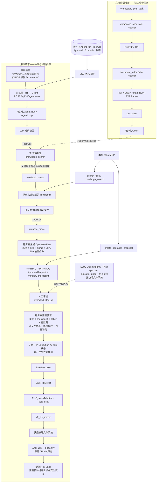

# FileNest V2

[English](README_V2.md) · [V1 English](README_V1.md) · [V1 中文](README_V1_zh.md)

FileNest V2 是一个本地优先的 FastAPI 后端，用于基于证据、可审核且可撤销的文件整理。

它将模型推理与文件系统权限明确分开：模型负责理解意图、检索工作区证据并提出操作建议；服务器负责验证建议、记录人工审批、执行获授权的文件操作，并依据执行历史和当前文件状态保护撤销过程。

## 核心架构与安全链路

下图保留了所提供 FileNest V2 架构图中的两条独立流程：文档索引准备发生在用户检索之前；用户请求只检索已经建立的 Chunk，取得证据后才可能生成移动提案。



Workspace Scan 和 Document Index 是显式后台 Job，并不会在每次 Agent 请求中重新运行。当前 `knowledge_search` 从已持久化的 Chunk 中执行不区分大小写的子串匹配，按出现次数排序，然后构造可追踪的 `RetrievalContext`，通过 `ToolResult` 把证据返回模型。

## 核心安全原则

- 模型负责理解意图、检索证据和提出操作建议；服务器负责验证、授权、执行和撤销。
- 模型输出、文档正文、HTTP 参数和 MCP 请求都是不可信输入，不是权限授予。
- Agent 与 MCP 的工具注册表都不暴露 approve、execute 或 undo 工具。
- 人工批准只改变持久化工作流状态，本身不会修改文件。
- 执行时重新读取服务器端计划，并复核审批、checkpoint、工作区 Policy、有效期、源文件前置条件、路径授权和目标冲突。
- 文件副作用只能通过 `SafeExecution` 进入。Move 和 Rename 使用 `SafeFileMover` → `FileSystemAdapter` / `PathPolicy` → `v2_file_mover`；Quarantine 在相同的执行与路径 Policy 边界下使用专用 Manager。
- Undo 依据已记录的 before/after 证据执行；恢复条件不安全或可能覆盖路径时会拒绝操作。

## 当前真实功能

### Workspace 与文件索引

- 注册、读取和列出已授权 Workspace。
- 通过持久化后台 Job 扫描 Workspace，并同步 `FileEntry`。
- 在绑定的 Workspace 内查询文件索引、元数据、目录和相似目录候选。
- 每次访问前应用 Workspace 读写 Policy 和路径授权。

### Agent Run 与 AgentLoop

- `POST /api/v1/agent-runs` 持久化 pending Run，并返回 `202` 和 `run_id`。
- 进程内后台执行器运行模型/工具循环，并持久化消息、模型轮次、工具调用、结果和指标。
- 可以列出和查看 Run；活动 Run 支持协作式取消；符合条件的失败或已取消 Run 可以从持久化上下文恢复。
- 循环执行最大步骤、超时/取消、精确工具注册、严格参数校验和 Workspace 绑定。
- 对外结果明确区分最终回答、来源引用、操作提案、状态、指标和稳定错误码。

### Tool Calling 与 Tool Registry

工作区绑定的 Agent Registry 当前只暴露以下工具：

| 只读证据工具 | 操作提案工具 |
|---|---|
| `list_directory` | `propose_move` |
| `find_similar_folders` | `propose_rename` |
| `search_files` | `propose_quarantine` |
| `get_file_metadata` | |
| `knowledge_search` | |

工具名称使用白名单，参数由 Pydantic 契约校验，并且每次 Agent 工具调用必须使用该 Run 绑定的 `workspace_id`。未知工具或跨 Workspace 调用会在进入 handler 之前失败。

Proposal 工具只创建服务器端 `WAITING_APPROVAL` 计划，不会直接移动、重命名或隔离文件。

### RAG 与 Knowledge Search

当前已实现的 Knowledge 链路是：

```text
Workspace Scan Job → FileEntry → Document Index Job → Parser → Document → Chunk
Chunk → 关键词 knowledge_search → RetrievalContext → ToolResult → LLM
```

- Document Indexer 当前支持 PDF、DOCX、Markdown 和 TXT。
- Document 与 Chunk 保留 Workspace、文件、source version、文本位置和引用来源信息。
- `knowledge_search` 绑定 Workspace、只读、最多返回 10 个 Chunk，并返回相对来源路径和稳定引用证据。
- 匹配方式是不区分大小写的子串包含；结果按查询词出现次数排序，同分时按路径和 Chunk 顺序稳定排序。
- 已索引文档正文只是证据。文档中的文字不能改变工具、Workspace 范围、Policy 或授权。
- 没有足够成功证据时，Agent 返回既定的无证据拒答，不会编造来源。

### Operation Proposal 与人工审批

- `propose_move`、`propose_rename` 和 `propose_quarantine` 复用服务器工作流 Service，创建 `OperationPlan` 与审批 checkpoint。
- 计划包含服务器解析的源路径、目标路径，以及 size、mtime 和 SHA-256 源文件前置条件。
- 初始状态为 `WAITING_APPROVAL`。人工决定必须通过 `expected_plan_id` 指向当前展示的计划；编辑会创建替代计划，不会静默修改已批准快照。
- approve、reject、edit 和 cancel 都是服务器端工作流状态转换；approve 本身不产生文件副作用。

### Server Validation、SafeExecution 与 SafeFileMover

执行前，服务器会重新读取 ready 工作流及已批准计划，并检查 expected plan/revision、审批关联、workflow checkpoint、当前 Workspace Policy、计划有效期、源文件身份和元数据、源/目标路径授权、目标目录以及目标冲突。

`SafeExecution` 在操作文件前先持久化 `OperationExecution`。每个 Execution Item 会在产生副作用前从 `PENDING` 转为 `EXECUTING`。随后 `SafeFileMover` 再次授权两个路径，要求目标目录已经存在，禁止覆盖和自动改名，并调用 V2 专用的精确目标 mover。操作完成后，FileNest 保存当前元数据/hash 证据并同步 `FileEntry` 位置。

执行层当前支持 move、rename 和 quarantine 计划项，同时具备幂等执行历史、部分完成状态，以及启动时对中断执行记录的恢复。Retry 与 compensation 是内部 Service 辅助能力；公开 Workflow API 暴露 execute 和 undo，没有独立的 retry 或 compensation 路由。

### Undo

Undo 会读取已完成的执行历史，用 after 证据校验当前目标，检查原路径可用且仍获授权，然后将 Item 切换到 undo 状态并执行反向安全移动。旧客户端请求本身不能成为撤销权限，也不会无条件覆盖现有路径。

### Job

Workspace Scan 与 Document Index 已通过当前持久化单进程 Job/Attempt 系统执行：

- 异步提交并返回稳定 `job_id`；
- 检测 Idempotency-Key 身份冲突；
- 持久化 Job 状态和只追加的 Attempt 历史；
- 提供按 Workspace 限定的列表与详情 API；
- 对符合条件的任务提供协作式取消和失败重试；
- 使用 revision compare-and-set 保护状态转换，并在启动时执行恢复检查。

Runner 位于当前进程并面向单机，不是分布式队列。Agent Run 使用独立后台执行器，不由 Job Runner 调度。

### SSE

- `GET /api/v1/agent-runs/{run_id}/events` 投影已持久化的 Agent Run 和 Tool Call 状态。
- `GET /api/v1/workflows/{workflow_id}/events` 投影审批、执行和 Undo 状态。
- Event Stream 使用有序事件 ID，并支持 `Last-Event-ID` 回放/恢复。
- SSE 只负责呈现状态，不会执行、批准、取消、恢复或撤销业务操作。浏览器断开不会删除已持久化的 Run 或 Workflow。

### MCP

本机 stdio MCP Server 只暴露：

- `search_files`
- `knowledge_search`
- `create_operation_proposal`

`create_operation_proposal` 复用正常服务器计划与工作流验证链路，并停在 `WAITING_APPROVAL`。MCP 不能 approve、execute 或 undo，也不开放网络 Transport。

## HTTP API 概览

| 范围 | 当前接口 |
|---|---|
| 健康检查与页面 | `GET /`、`GET /api/v1/health`，OpenAPI 位于 `/docs` |
| Workspace 与文件 | 创建/列出/读取 Workspace；列出/读取文件索引 |
| 后台 Job | 提交 Workspace Scan 或 Document Index；列出/读取/cancel/retry Job |
| Knowledge | 列出/读取/删除索引文档；对 Chunk 执行关键词检索 |
| Agent Run | 创建/列出/读取/cancel/resume Run；读取 Agent SSE |
| Plan 与 Approval | 创建/读取 Workflow；列出计划与待审批项；执行 approve/edit/reject/cancel 决定 |
| 安全操作 | execute 和 undo 已批准 Workflow；读取 Workflow SSE |
| Evaluation | 提交 Evaluation Run，并读取状态与结果 |

当前检出版本的完整请求/响应契约以 `http://127.0.0.1:8000/docs` 中的交互式 OpenAPI 为准。

## 环境要求与安装

- Python 3.13
- 下列命令使用 Windows PowerShell
- 只有旧版 V1 桌面程序要求 Windows

```powershell
git clone https://github.com/PoH888/FileNest.git
Set-Location .\FileNest

py -3.13 -m venv .venv
& .\.venv\Scripts\python.exe -m pip install --upgrade pip
& .\.venv\Scripts\python.exe -m pip install -r .\requirements.txt
```

开发和验证时应安装 `requirements-dev.txt`，而不是只安装运行时依赖。

## 本地运行 V2

先在 `backend` 目录应用数据库迁移，再从仓库根目录启动 ASGI 应用：

```powershell
$python = (Resolve-Path .\.venv\Scripts\python.exe).Path

Push-Location .\backend
& $python -m alembic upgrade head
Pop-Location

& $python -m uvicorn backend.app.main:app --host 127.0.0.1 --port 8000
```

随后访问：

- FileNest V2 最小页面：<http://127.0.0.1:8000/>
- OpenAPI 页面：<http://127.0.0.1:8000/docs>
- 健康检查：<http://127.0.0.1:8000/api/v1/health>

当前最小页面可以注册/选择 Workspace、提交和观察 Scan/Index Job、运行 Agent、查看来源与 Proposal、审核 Plan、批准或拒绝、执行并请求 Undo。

### 典型文档检索与整理流程

1. 注册或选择 Workspace。
2. 提交 `POST /api/v1/workspaces/{workspace_id}/scan`，然后轮询对应 Job。
3. 提交 `POST /api/v1/workspaces/{workspace_id}/documents/index`，然后轮询对应 Job。
4. 使用 Workspace ID 和自然语言请求提交 `POST /api/v1/agent-runs`。
5. 读取 Agent 状态或 SSE；Agent 调用 `knowledge_search` 时会检索第 3 步已经建立的 Chunk。
6. 查看返回的 Proposal 和 `OperationPlan`。
7. 批准当前准确 Plan，再调用 execute 接口。
8. 需要恢复时，通过 Workflow 执行历史发起受保护的 Undo。

### 启动本机 MCP Server

```powershell
& .\.venv\Scripts\python.exe -m backend.app.mcp_server
```

该进程通过 stdin/stdout 通信，并使用与后端模块相同的数据库配置和 Workspace Policy。

### 使用 Docker Compose

```powershell
docker compose up --build --detach
Invoke-RestMethod -Uri http://127.0.0.1:8000/api/v1/health
docker compose down
```

Compose Service 将 API 绑定到 `127.0.0.1:8000`，启动时应用迁移，并把 SQLite 数据库和 workflow checkpoint 保存在数据卷中。

## 配置

| 环境变量 | 用途 |
|---|---|
| `FILENEST_DATABASE_URL` | SQLAlchemy 业务数据库 URL；本地默认使用 SQLite |
| `FILENEST_WORKFLOW_CHECKPOINT_PATH` | SQLite workflow checkpoint 路径 |
| `FILENEST_MODEL_PROVIDER` | OpenAI-compatible 模型 Provider 标识 |
| `FILENEST_MODEL_NAME` | 模型名称 |
| `FILENEST_MODEL_API_KEY` | 模型 API Key；必须保留在仓库外 |
| `FILENEST_QUARANTINE_ROOT` | 可选的受控隔离区根目录 |

`.env.example` 只应作为本地模板。Docker Compose 会读取 `.env` 做变量插值；直接运行 Uvicorn 不会自动加载 `.env`，应在当前 PowerShell Session 或其他进程级配置来源中设置变量。

## 测试与当前架构

运行 CI 中配置的主要检查：

```powershell
& .\.venv\Scripts\python.exe -m pip install -r .\requirements-dev.txt
& .\.venv\Scripts\python.exe -m pip check
& .\.venv\Scripts\python.exe -m pytest tests -q -p no:cacheprovider
& .\.venv\Scripts\python.exe -m ruff check .
& .\.venv\Scripts\python.exe -m mypy -p backend.app
```

当前 CI Workflow 会运行依赖检查、完整测试集、Ruff 和 mypy；还会构建 Compose Image、启动 Service、等待 Health Check，并请求 V2 健康接口。

当前持久化与运行边界：

- SQLAlchemy 保存 Workspace、文件/文档索引、Agent 记录、Plan、Approval、执行历史、Job 和 Attempt；本地默认数据库是 SQLite。
- LangGraph 使用独立 SQLite checkpoint store 保存审批工作流状态；一致性由验证与恢复逻辑维护，不依赖跨数据库事务。
- Agent Run 使用进程内后台线程池；Workspace Scan 和 Document Index 使用持久化单进程 Job Runner。
- 当前 `knowledge_search` 实现为关键词包含检索。
- 当前 Server 没有用户登录、角色模型或远程多租户授权层；Workspace 与 Path Policy 是已实现的授权边界。
- MCP 仅支持本机 stdio；当前不声称具备分布式 Worker 或远程 MCP Service。

## 项目结构

```text
FileNest/
├── backend/
│   ├── app/                 # V2 API、Agent、工具、检索、工作流、Job 与安全执行
│   ├── alembic/             # 数据库迁移
│   └── alembic.ini
├── core/                    # 共享扫描/匹配辅助模块与旧版桌面模块
├── gui/                     # 旧版桌面 UI
├── tests/                   # 单元、集成、安全、恢复与 API 测试
├── assets/                  # 图标与桌面演示媒体
├── main.py                  # V1 桌面入口
├── Dockerfile               # V2 API Image
├── compose.yaml             # V2 API 与持久化数据卷
├── requirements.txt         # 运行时依赖
└── requirements-dev.txt     # 开发与验证依赖
```

V2 Container 只复制后端需要的共享 `core` 扫描/匹配辅助模块，不打包 V1 的直接写文件 mover。

## License

[MIT](LICENSE)
