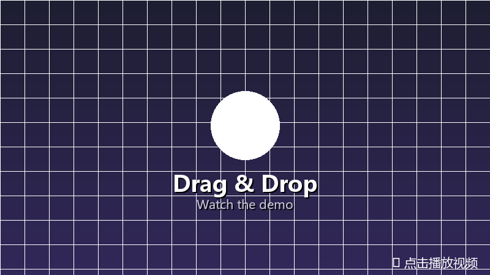
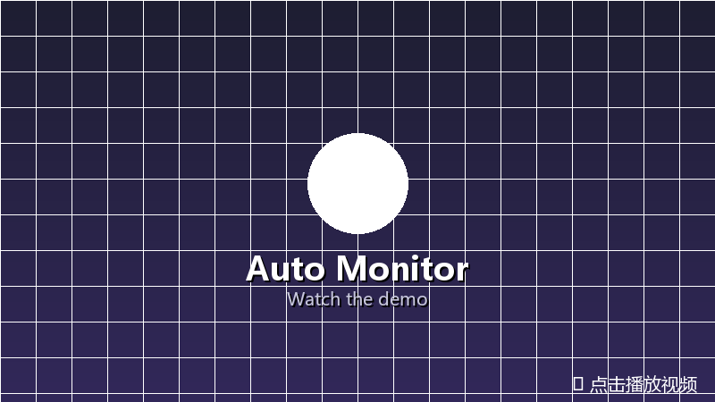

# FileNest 📃 → 🪹

> A local-first file organization project with an evidence-first V2 backend.

This repository contains two related paths:

- **Legacy Windows desktop app**: drag-and-drop sorting, fuzzy directory matching, optional folder monitoring, and local undo.
- **FileNest V2 backend**: a FastAPI application that makes file organization explicit, reviewable, and safe: query → plan preview → approval → execution → undo.

The V2 status and boundaries below describe the current code, not a future roadmap.

---

## Current V2 capability

The V2 backend currently provides:

- authorized workspace registration, explicit workspace scanning, file search, and file metadata retrieval;
- document loading, traceable chunks, keyword knowledge search, and an offline experimental vector path;
- a read-only Agent run with persisted run/tool state and SSE state projection;
- operation-plan preview, persisted approval decisions, safe execution, execution history, and guarded undo;
- a local-stdio MCP server exposing `search_files`, `knowledge_search`, and `create_operation_proposal`.

The main V2 safety chain is deliberately explicit. Approval changes workflow state but does not write files. Execution reloads the approved checkpoint and revalidates authorization, the plan, and file preconditions. Undo relies on recorded execution history and current file metadata rather than unconditionally overwriting a path.

## V2 Agent / V2 API Security Boundary

This Human-in-the-loop security boundary applies only to the V2 Agent and V2
API paths described above. The V1 Windows desktop path starts at `main.py`,
and its legacy direct-write `core/file_mover.py` is outside this boundary.
The V2 API image does not package that V1 mover. This README therefore makes
no repository-wide security guarantee.

## Existing desktop demo media

These clips show the legacy Windows desktop application. They are not evidence that the V2 backend has integrated the legacy file monitor.

[📥 Download](https://github.com/PoH888/FileNest/releases)

---

[](https://cdn.jsdelivr.net/gh/PoH888/FileNest@main/assets/English-Operate.mp4)

*Legacy desktop drag-and-drop sorting*

[](https://cdn.jsdelivr.net/gh/PoH888/FileNest@main/assets/English-Monitor.mp4)

*Legacy desktop folder monitoring*

## Representative V2 demonstration

The reproducible local demonstration uses a dedicated workspace and a fixed 187-byte ZIP file. The recorded SHA-256 is:

```text
02394A5D0DB905108D69D44ADCCAE3036AB02727CF456848688DAF28C30C16C3
```

The demonstrated state sequence is:

```text
waiting / WAITING_APPROVAL
        ↓ approve
ready / APPROVED
        ↓ execute
COMPLETED
        ↓ undo
UNDONE
```

The existing run record checks that the source file returns after undo and that its SHA-256 is unchanged. The deterministic API path uses indexed file search and does not require an external model. The browser Agent query path requires valid local model settings; it is not treated as evidence of model quality.

## Requirements

- Python 3.13 is the locally validated version for the V2 backend.
- Windows is required for the legacy desktop application.
- Docker Compose configuration is included for the V2 API, but this environment has not verified a local Docker build or container run.

## Installation

Run the following commands in PowerShell from the directory where you keep the repository:

```powershell
git clone https://github.com/PoH888/FileNest.git
Set-Location .\FileNest

py -3.13 -m venv .venv
& .\.venv\Scripts\python.exe -m pip install --upgrade pip
& .\.venv\Scripts\python.exe -m pip install -r .\requirements.txt
```

The CI-equivalent test commands additionally require `pytest` and `httpx`:

```powershell
& .\.venv\Scripts\python.exe -m pip install pytest httpx
```

## Usage

### V1 legacy desktop application

The V1 Windows desktop application starts at `main.py`:

```powershell
& .\.venv\Scripts\python.exe .\main.py
```

### V2 API locally

The V2 startup entrypoint is the ASGI application `backend.app.main:app`.
Run the migration from the `backend` directory, then start the existing FastAPI
app from the repository root:

```powershell
$python = (Resolve-Path .\.venv\Scripts\python.exe).Path

Push-Location .\backend
& $python -m alembic upgrade head
Pop-Location

& $python -m uvicorn backend.app.main:app --host 127.0.0.1 --port 8000
```

In another PowerShell window, check the API and open the interactive docs at
<http://127.0.0.1:8000/docs>:

```powershell
Invoke-RestMethod -Uri http://127.0.0.1:8000/api/v1/health
```

The expected health response is `status: ok`. Open
<http://127.0.0.1:8000/> for the current minimal V2 UI, or
<http://127.0.0.1:8000/docs> for the OpenAPI UI.

The UI can select a workspace, submit a read-only Agent request, inspect
sources, create a plan, approve or reject it, execute an approved plan, and
undo a completed execution. A valid model configuration is required for the
Agent request. Without a model configuration, use the deterministic HTTP chain
in the E39-03 local video script.

### V2 API with Docker Compose

The repository contains a Compose definition for the API and its SQLite data
volume. This environment has not verified a local Docker build or container
run, so the following is a configuration reference rather than a recorded
execution result:

```powershell
docker compose up --build --detach
Invoke-RestMethod -Uri http://127.0.0.1:8000/api/v1/health
docker compose down
```

If model settings are needed, Compose reads `.env` for interpolation. A direct
local Uvicorn run reads environment variables from the current PowerShell
session and does not load `.env` automatically.

### Deterministic HTTP chain

The no-model demonstration uses current API responses and dynamic IDs. Its
endpoint order is:

1. `GET` or `POST /api/v1/workspaces` — find or register the dedicated workspace;
2. `POST /api/v1/workspaces/{workspace_id}/scan` — synchronize the file index;
3. `GET /api/v1/workspaces/{workspace_id}/files` — query the fixed ZIP;
4. `POST /api/v1/workflows` — create a waiting approval plan;
5. `POST /api/v1/workflows/{workflow_id}/decisions` — approve the displayed plan;
6. `POST /api/v1/workflows/{workflow_id}/execute` — execute the approved plan;
7. `POST /api/v1/workflows/{workflow_id}/undo` — restore the file from execution history.

Use the fixed-file preparation and complete PowerShell chain in
`docs/E29-04-可复现运行说明与工程调用链.md` when working from this checkout.
Do not hard-code old workspace, file, workflow, or plan IDs. If the target file
already exists, inspect the previous run and undo it instead of deleting files
with a broad reset command.

### Local-stdio MCP server

The current MCP entrypoint is:

```powershell
& .\.venv\Scripts\python.exe -m backend.app.mcp_server
```

It exposes only the current read-only search tools and a pending operation
proposal. It does not expose approval, execution, or undo tools, and it does
not open a network transport.

## Dependencies

| Dependency | Purpose |
|------------|---------|
| [thefuzz](https://github.com/seatgeek/thefuzz) / [rapidfuzz](https://github.com/rapidfuzz/RapidFuzz) | Fuzzy file name matching |
| [watchdog](https://github.com/gorakhargosh/watchdog) | File system monitoring |
| [pystray](https://github.com/moses-palmer/pystray) / [Pillow](https://python-pillow.org) | System tray and icon support |
| [tkinterdnd2](https://github.com/pmgagne/tkinterdnd2) | Desktop drag-and-drop support |
| [FastAPI](https://fastapi.tiangolo.com) / [Uvicorn](https://www.uvicorn.org) | V2 HTTP API and ASGI server |
| [SQLAlchemy](https://www.sqlalchemy.org) / [Alembic](https://alembic.sqlalchemy.org) | SQLite persistence and migrations |
| [Pydantic](https://docs.pydantic.dev) / `pydantic-settings` | Contracts and environment configuration |
| [OpenAI Python SDK](https://github.com/openai/openai-python) | OpenAI-compatible model client |
| [LangGraph](https://github.com/langchain-ai/langgraph) / `langgraph-checkpoint-sqlite` | Workflow execution and checkpoints |
| `pypdf` / `python-docx` | PDF and DOCX text extraction |
| `pytest` / `httpx` | Local and CI test execution; installed separately from runtime dependencies |

> tkinter is part of the Python standard library — no extra installation needed.

## Project Structure

```
FileNest/
├── main.py                    # Legacy desktop entrypoint
├── backend/
│   ├── app/                   # V2 FastAPI application and services
│   ├── alembic/               # Database migrations
│   ├── evaluation/            # Recorded evaluation and scale results
│   └── alembic.ini
├── core/                      # Legacy desktop/file logic
├── gui/                       # Legacy desktop UI
├── tests/                     # Unit, integration, security, and evaluation tests
├── assets/                    # Icons, images, and demo media
├── .github/workflows/ci.yml   # Curated CI test groups
├── Dockerfile                 # V2 API image
├── compose.yaml               # API plus SQLite volume
├── .env.example               # Local/Compose environment template
└── requirements.txt           # Runtime dependencies
```

## Packaging

The commands below package the existing Windows desktop entrypoint (`main.py`).
The V2 API is run with Uvicorn or Docker Compose and is not bundled into the
desktop executable. Run these commands from the repository root in PowerShell:

```powershell
& .\.venv\Scripts\python.exe -m pip install pyinstaller
Remove-Item -Recurse -Force .\dist, .\build -ErrorAction SilentlyContinue
& .\.venv\Scripts\pyinstaller.exe --noconsole --onefile --name FileNest --add-data "assets;assets" --icon "assets\FileNest_big.ico" .\main.py
New-Item -ItemType Directory -Force .\dist\FileNest | Out-Null
Move-Item -Force .\dist\FileNest.exe .\dist\FileNest\
& .\.venv\Scripts\python.exe -c "import zipfile; zipfile.ZipFile('FileNest.zip','w',zipfile.ZIP_DEFLATED).write('dist/FileNest/FileNest.exe','FileNest.exe')"
```

Distribution structure:

```
FileNest.zip
  └── extract → FileNest/
                   └── FileNest.exe    ← settings.json auto-generated here on first run
```

> **Note**: With `--onefile`, `settings.json` is auto-generated on first run in the same directory as the exe (i.e., inside `FileNest/`). Moving the whole folder carries the config with it.

## Configuration

### Legacy desktop settings

`settings.json` is auto-generated on first run of the desktop application. It
can be modified through the settings window:

| Config Key | Description | Default |
|------------|-------------|---------|
| Classification directories | Root directories for file sorting | `[]` |
| Scan depth | Subfolder scanning level | 5 |
| Auto threshold | Auto-move above this score | 85 |
| Parent folder weighting | Bonus for matching parent dir name | On |
| Ignore list | File name keywords to skip | — |
| Language | zh / en | zh |

### V2 API environment

The V2 API accepts these environment variables:

| Variable | Description | Default or example |
|----------|-------------|--------------------|
| `FILENEST_DATABASE_URL` | SQLAlchemy database URL | `sqlite:///./backend/filenest.db` locally |
| `FILENEST_MODEL_PROVIDER` | Model provider name | See `.env.example` |
| `FILENEST_MODEL_NAME` | Model name | See `.env.example` |
| `FILENEST_MODEL_API_KEY` | Model API key | Keep local; never commit a real key |

For Docker Compose, use `.env.example` as the template for `.env`. For a
direct local run, set the variables in the current PowerShell session before
starting Uvicorn.

## Running Tests

Install the two test-only packages first, then run a representative local smoke test:

```powershell
& .\.venv\Scripts\python.exe -m pip install pytest httpx
& .\.venv\Scripts\python.exe -m pip check
& .\.venv\Scripts\python.exe -m pytest `
  .\tests\test_matcher.py `
  .\tests\test_backend_migrations.py `
  .\tests\test_path_policy.py `
  .\tests\test_agent_evaluation.py `
  -q -p no:cacheprovider
```

GitHub Actions runs the complete curated, non-overlapping unit, integration,
security, and evaluation groups defined in `.github/workflows/ci.yml` on pushes,
pull requests, and manual dispatch. It does not require a coverage threshold.

## How It Works

### Legacy desktop matching strategy

1. File name normalization → strip extension, replace separators, lowercase
2. `thefuzz.token_sort_ratio` + `partial_ratio` for base score
3. Keyword overlap bonus (EN/CN bigrams + continuous substrings)
4. Parent folder weighting (parent dir name match bonus)
5. Candidates below 55 are discarded

### Legacy desktop match decision

- **No match** (0 candidates) → Prompt manual handling
- **Strong match** (1 candidate ≥ 85) → Auto-move
- **Multiple candidates** (≥2) → Selection window
- **Nested overlap** (parent + child dirs in candidates) → Tree selection window

## Current V2 boundaries

- The legacy desktop monitor is not integrated into the V2 Job/Attempt or document-indexing path.
- V2 Agent POST execution is currently synchronous; SSE projects persisted Agent state and does not itself execute or cancel business work.
- Large workspace scans and document indexing have local long-task evidence, but the Job/Attempt baseline is not fully connected to HTTP, scanning, or document indexing.
- Keyword retrieval remains the default; vector retrieval is experimental and no external vector database is adopted.
- Redis, Celery, distributed workers, user authentication, multi-tenant isolation, and a remote MCP transport are not current V2 capabilities.
- This repository contains no verified production deployment, production user count, QPS, SLA, real-model accuracy, or real-embedding quality claim.

## License

MIT

# 🐱
