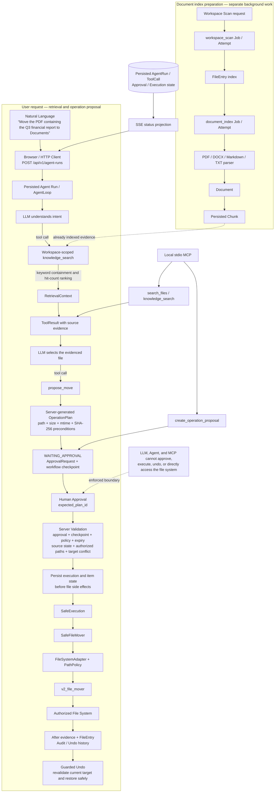

# FileNest V2

[中文](README_V2_zh.md) · [V1 English](README_V1.md) · [V1 中文](README_V1_zh.md)

FileNest V2 is a local-first FastAPI backend for evidence-based, reviewable, and reversible file organization.

It separates model reasoning from file-system authority. The model interprets intent, retrieves workspace evidence, and proposes an operation. The server validates the proposal, records human approval, performs the authorized file operation, and protects undo with execution history and current-file checks.

## Core architecture and safety chain

The diagram below preserves the two distinct flows in the supplied FileNest V2 architecture: document-index preparation happens before user retrieval, while a user request searches the already indexed chunks and may then produce a move proposal.



Workspace scanning and document indexing are explicit background jobs. They are not rerun for every Agent request. The current `knowledge_search` path queries persisted chunks with case-insensitive substring matching and ranks them by occurrence count before building a traceable `RetrievalContext` and returning a `ToolResult` to the model.

## Core safety principles

- The model understands intent, retrieves evidence, and proposes operations; the server validates, authorizes, executes, and undoes them.
- Model output, document text, HTTP parameters, and MCP requests are untrusted inputs, not permission grants.
- The Agent and MCP registries do not expose approval, execution, or undo tools.
- Human approval changes persisted workflow state but does not itself modify files.
- Execution reloads the server-side plan and revalidates approval, checkpoint state, workspace policy, expiry, source preconditions, path authorization, and target conflicts.
- File side effects enter only through `SafeExecution`. Move and rename use `SafeFileMover` → `FileSystemAdapter` / `PathPolicy` → `v2_file_mover`; quarantine uses its dedicated manager under the same execution and path-policy boundary.
- Undo is based on recorded before/after evidence and refuses unsafe restoration or overwrite conditions.

## Current features

### Workspaces and file index

- Register and list authorized workspaces.
- Scan a workspace through a persistent background Job and synchronize `FileEntry` records.
- Query indexed files, metadata, directories, and similar folder candidates within the bound workspace.
- Apply workspace read/write policy and path authorization before access.

### Agent Run and AgentLoop

- `POST /api/v1/agent-runs` persists a pending run and returns `202` with a `run_id`.
- An in-process background executor runs the model/tool loop with persisted messages, model turns, tool calls, result data, and metrics.
- Runs can be listed and inspected. Active runs support cooperative cancellation; eligible failed or cancelled runs can resume from persisted context.
- The loop enforces maximum steps, timeout/cancellation boundaries, exact tool registration, strict argument validation, and workspace binding.
- The public result separates the final answer, source references, generated proposals, status, metrics, and stable error codes.

### Tool calling and Tool Registry

The workspace-scoped Agent registry currently exposes exactly these tools:

| Read-only evidence tools | Proposal tools |
|---|---|
| `list_directory` | `propose_move` |
| `find_similar_folders` | `propose_rename` |
| `search_files` | `propose_quarantine` |
| `get_file_metadata` | |
| `knowledge_search` | |

Tool names are allowlisted, arguments are validated by Pydantic contracts, and every Agent tool call must use the run's bound `workspace_id`. Unknown tools and cross-workspace calls fail before their handlers can perform work.

Proposal tools create a server-side plan in `WAITING_APPROVAL`; they do not move, rename, or quarantine files.

### RAG and knowledge search

The implemented knowledge path is:

```text
Workspace Scan Job → FileEntry → Document Index Job → Parser → Document → Chunk
Chunk → keyword knowledge_search → RetrievalContext → ToolResult → LLM
```

- The document indexer currently supports PDF, DOCX, Markdown, and TXT sources.
- Documents and chunks keep workspace, file, source-version, position, and citation provenance.
- `knowledge_search` is workspace-scoped, read-only, limited to at most 10 chunks, and returns relative source paths plus stable citation evidence.
- Matching is case-insensitive substring containment. Results are ranked by the number of query occurrences, with stable path/chunk ordering for ties.
- Indexed document text is evidence only. Instructions found inside a document cannot change tools, workspace scope, policy, or authorization.
- If sufficient successful evidence is unavailable, the Agent returns the configured no-evidence refusal instead of inventing a source.

### Operation proposal and human approval

- `propose_move`, `propose_rename`, and `propose_quarantine` reuse the server workflow service to create an `OperationPlan` and approval checkpoint.
- A plan contains server-resolved source and target paths plus size, modification time, and SHA-256 source preconditions.
- The initial state is `WAITING_APPROVAL`. A human decision must identify the currently displayed plan with `expected_plan_id`; edits create a replacement plan instead of silently mutating an approved snapshot.
- Approval, rejection, edit, and cancellation are server-side workflow transitions. Approval alone has no file-system side effect.

### Server validation, SafeExecution, and SafeFileMover

Before execution, the server reloads the ready workflow and approved plan. It checks the expected plan/revision, approval association, workflow checkpoint, current workspace policy, plan expiry, source identity and metadata, authorized source/target paths, destination directory, and target conflicts.

`SafeExecution` persists an `OperationExecution` before performing a file operation. Each execution item moves from `PENDING` to `EXECUTING` before its side effect. The `SafeFileMover` then reauthorizes both paths, requires an existing destination directory, forbids overwrites and automatic renaming, and calls the V2-specific exact-target mover. After the operation, FileNest records current metadata/hash evidence and synchronizes the `FileEntry` location.

The execution layer supports move, rename, and quarantine plan items, idempotent execution history, partial-result states, and startup recovery for interrupted execution records. Retry and compensation exist as internal service helpers; the public workflow API exposes execute and undo rather than standalone retry or compensation routes.

### Undo

Undo loads the completed execution history, checks the current target against recorded after evidence, checks that the original path is available and authorized, transitions the item into an undo state, and performs a reverse safe move. It never treats an old client request as sufficient authority and does not unconditionally overwrite a path.

### Jobs

Workspace scanning and document indexing run through the current persistent single-process Job/Attempt system:

- asynchronous submission with a stable `job_id`;
- idempotency-key conflict detection;
- persisted Job state and append-only Attempt history;
- workspace-scoped list and detail APIs;
- cooperative cancellation and retry of eligible failures;
- revision compare-and-set protection and startup recovery checks.

The runner is in-process and single-host. It is not a distributed queue, and Agent Runs use their own background executor rather than the Job runner.

### SSE

- `GET /api/v1/agent-runs/{run_id}/events` projects persisted Agent Run and tool-call state.
- `GET /api/v1/workflows/{workflow_id}/events` projects approval, execution, and undo state.
- Streams support ordered event IDs and `Last-Event-ID` replay/recovery.
- SSE presents state; it does not execute, approve, cancel, resume, or undo business work. Disconnecting a browser does not delete the persisted run or workflow.

### MCP

The local stdio MCP server exposes only:

- `search_files`
- `knowledge_search`
- `create_operation_proposal`

`create_operation_proposal` reuses the normal server planning and workflow validation path and stops at `WAITING_APPROVAL`. MCP cannot approve, execute, or undo a plan and does not expose a network transport.

## HTTP API overview

| Area | Current endpoints |
|---|---|
| Health and UI | `GET /`, `GET /api/v1/health`, OpenAPI at `/docs` |
| Workspaces and files | create/list/get workspaces; list/get indexed files |
| Background jobs | submit workspace scan or document index; list/get/cancel/retry jobs |
| Knowledge | list/get/delete indexed documents; keyword search indexed chunks |
| Agent Runs | create/list/get/cancel/resume runs; stream Agent SSE |
| Plans and approvals | create/get workflows; list plans and pending approvals; approve/edit/reject/cancel decisions |
| Safe operations | execute and undo approved workflows; stream workflow SSE |
| Evaluation | submit an evaluation run and read its status/results |

The interactive OpenAPI schema at `http://127.0.0.1:8000/docs` is the authoritative request/response reference for the current checkout.

## Requirements and installation

- Python 3.13
- Windows PowerShell for the commands below
- Windows is required only for the legacy V1 desktop application

```powershell
git clone https://github.com/PoH888/FileNest.git
Set-Location .\FileNest

py -3.13 -m venv .venv
& .\.venv\Scripts\python.exe -m pip install --upgrade pip
& .\.venv\Scripts\python.exe -m pip install -r .\requirements.txt
```

For development and verification, install `requirements-dev.txt` instead of the runtime-only requirements file.

## Run V2 locally

Apply the database migrations from `backend`, then start the ASGI application from the repository root:

```powershell
$python = (Resolve-Path .\.venv\Scripts\python.exe).Path

Push-Location .\backend
& $python -m alembic upgrade head
Pop-Location

& $python -m uvicorn backend.app.main:app --host 127.0.0.1 --port 8000
```

Then open:

- Minimal FileNest V2 UI: <http://127.0.0.1:8000/>
- OpenAPI UI: <http://127.0.0.1:8000/docs>
- Health endpoint: <http://127.0.0.1:8000/api/v1/health>

The minimal UI can register/select a workspace, submit and observe scan/index Jobs, run the Agent, inspect sources and proposals, review a plan, approve or reject it, execute it, and request undo.

### Typical indexed-document flow

1. Register or select a workspace.
2. Submit `POST /api/v1/workspaces/{workspace_id}/scan`, then poll its Job.
3. Submit `POST /api/v1/workspaces/{workspace_id}/documents/index`, then poll its Job.
4. Submit `POST /api/v1/agent-runs` with the workspace ID and natural-language request.
5. Read the Agent state or SSE stream. If the Agent calls `knowledge_search`, it searches the chunks prepared in step 3.
6. Review the returned Proposal and `OperationPlan`.
7. Approve the exact current plan, then call the execute endpoint.
8. Use the workflow execution history for guarded undo when needed.

### Run the local MCP server

```powershell
& .\.venv\Scripts\python.exe -m backend.app.mcp_server
```

The process communicates over stdin/stdout and uses the same configured database and workspace policies as the backend modules.

### Run with Docker Compose

```powershell
docker compose up --build --detach
Invoke-RestMethod -Uri http://127.0.0.1:8000/api/v1/health
docker compose down
```

The Compose service binds the API to `127.0.0.1:8000`, applies migrations on startup, and stores the SQLite database and workflow checkpoints in its data volume.

## Configuration

| Variable | Purpose |
|---|---|
| `FILENEST_DATABASE_URL` | SQLAlchemy business database URL; the local default is SQLite |
| `FILENEST_WORKFLOW_CHECKPOINT_PATH` | SQLite workflow-checkpoint path |
| `FILENEST_MODEL_PROVIDER` | OpenAI-compatible model provider identifier |
| `FILENEST_MODEL_NAME` | Model name |
| `FILENEST_MODEL_API_KEY` | Model API key; keep it outside the repository |
| `FILENEST_QUARANTINE_ROOT` | Optional controlled quarantine root |

Copy `.env.example` only as a local template. Docker Compose reads `.env` for interpolation; a direct Uvicorn command does not automatically load `.env`, so set variables in the current PowerShell session or another process-level configuration source.

## Tests and current architecture

Run the same main checks configured in CI:

```powershell
& .\.venv\Scripts\python.exe -m pip install -r .\requirements-dev.txt
& .\.venv\Scripts\python.exe -m pip check
& .\.venv\Scripts\python.exe -m pytest tests -q -p no:cacheprovider
& .\.venv\Scripts\python.exe -m ruff check .
& .\.venv\Scripts\python.exe -m mypy -p backend.app
```

The CI workflow runs dependency checks, the complete test suite, Ruff, and mypy. It also builds the Compose image, starts the service, waits for its health check, and calls the V2 health endpoint.

Current persistence and runtime boundaries:

- SQLAlchemy stores workspaces, file/document indexes, Agent records, plans, approvals, execution history, Jobs, and Attempts. The default local database is SQLite.
- LangGraph uses a separate SQLite checkpoint store for approval workflow state; consistency is enforced by validation and recovery logic rather than a cross-database transaction.
- Agent Runs use an in-process background thread pool. Workspace scan and document-index work use the persistent single-process Job runner.
- Keyword containment search is the current `knowledge_search` implementation.
- The current server has no user login, role model, or remote multi-tenant authorization layer. Workspace and path policy are the implemented authorization boundary.
- MCP is local stdio only. The server does not claim distributed workers or a remote MCP service.

## Project structure

```text
FileNest/
├── backend/
│   ├── app/                 # V2 API, Agent, tools, retrieval, workflows, jobs, execution
│   ├── alembic/             # Database migrations
│   └── alembic.ini
├── core/                    # Shared scan/match helpers and legacy desktop modules
├── gui/                     # Legacy desktop UI
├── tests/                   # Unit, integration, security, recovery, and API tests
├── assets/                  # Icons and desktop demo media
├── main.py                  # V1 desktop entrypoint
├── Dockerfile               # V2 API image
├── compose.yaml             # V2 API and persistent data volume
├── requirements.txt         # Runtime dependencies
└── requirements-dev.txt     # Development and verification dependencies
```

The V2 container copies only the shared `core` scan/match helpers required by the backend; it does not package the V1 direct-write mover.

## License

[MIT](LICENSE)
